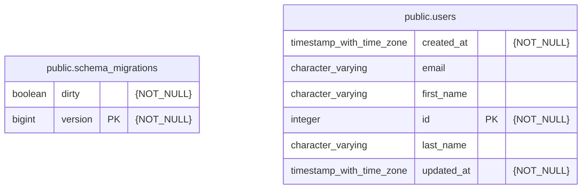

```mermaid
erDiagram
    "public.schema_migrations" {
        boolean dirty "{NOT_NULL}"
        bigint version PK "{NOT_NULL}"
    }

    "public.users" {
        timestamp_with_time_zone created_at "{NOT_NULL}"
        character_varying email 
        character_varying first_name 
        integer id PK "{NOT_NULL}"
        character_varying last_name 
        timestamp_with_time_zone updated_at "{NOT_NULL}"
    }

```